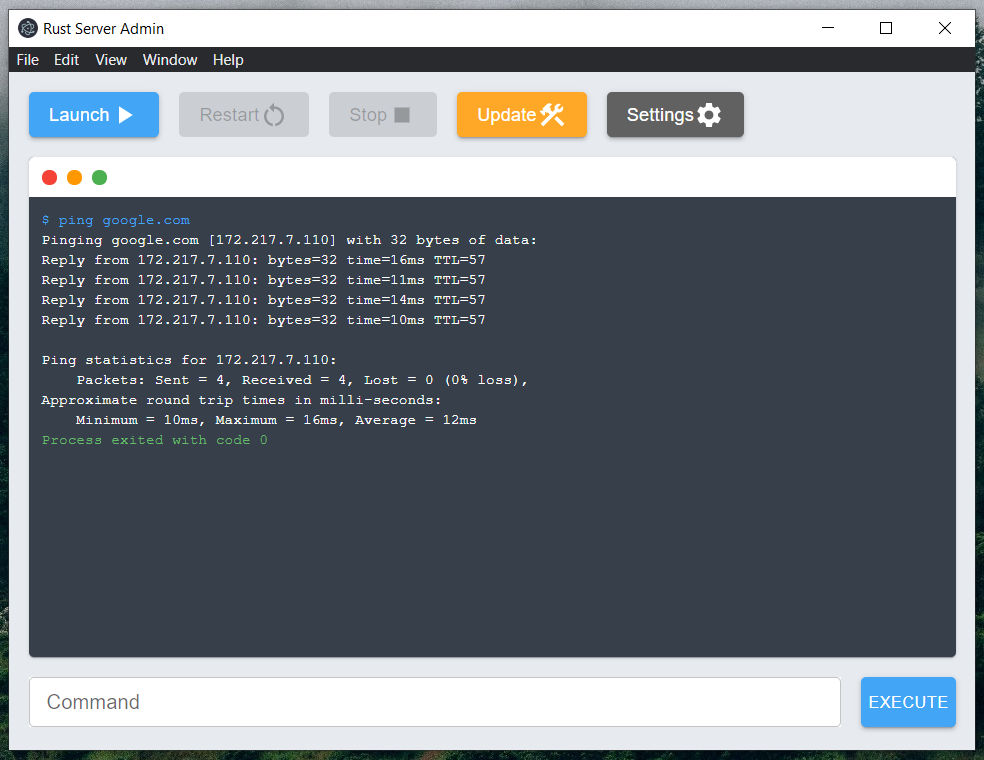

# React Server GUI

This is a GUI for server admins to more easily manage their servers.
This allows them to start, stop, restart, and update their servers.

React | Electron | Parcel

In progress:

- Trigger Events
- Chat Window
- View Players
- Call Commands
